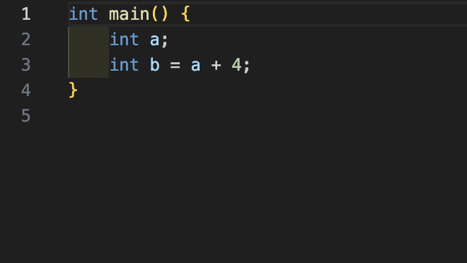
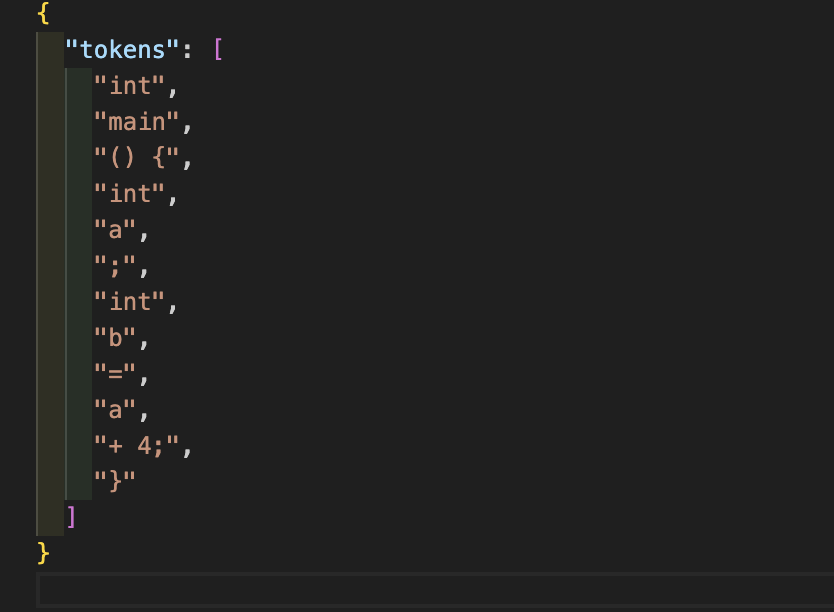

# fork-in-lsp

`fork-in-lsp` — это утилита на C++, которая реализует взаимодействие с сервером Language Server Protocol (LSP) и извлекает токены, сохраняя их в JSON-формате.

## Компиляция
Запустите
```sh
./setup.sh
cmake .
make
```


## Использование
```sh
./tokenize <input_file> <output_raw_file> <output_file>
```

## Выходной формат
Программа генерирует файл с потоком токенов в JDR формате






## Тесты
Чтобы запустить тесты необходимо выполнить

```sh
./test.sh
```
